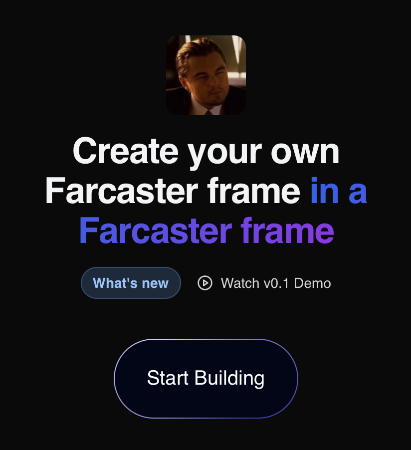

# frameception



# Run frontend

pnpm dev

# Deploy backend

```bash
modal deploy backend/main.py
```


# todo:
1. fix llm returns name in example:
'NeonFramePhoenix  \nTronPulseVibe  \nCyberVibesHub'

2. add sandbox so we can run pnpm build after new commits